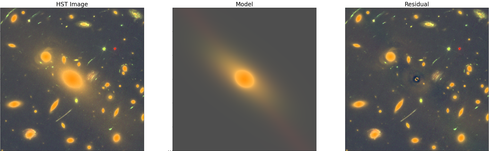

.. meta::
    :keywords: petrofit, sersic fitting, python sersic fitting, sersic profile, petrosian, petrosian radius, galaxy sizes, astropy, photutils, python
    :google-site-verification: cGJeqxHDRwD274HDKyUfULiLjCZ5-UTJZK5h_TNMjPg

######################
PetroFit Documentation
######################
|github tag| |astopy tag| |photutils tag| |zonodo tag|

PetroFit is a Python package for calculating Petrosian properties, such as radii and concentration indices, as well as fitting
galaxy light profiles. In particular, PetroFit includes tools for performing accurate photometry, segmentations, Petrosian profiling, and Sérsic fitting. This documentation is intended to serve as a description and guide to the `petrofit` Python module. See the  `Table of Contents <Table of Contents_>`_ below or use the sidebar to navigate this documentation.

|

Table of Contents
=================
    
.. toctree::
    :caption: Fundamentals
    :maxdepth: 2
    
    introduction
    installation
    quick_start
    photometry_and_petrosian
    fitting

.. toctree::
    :caption: Advanced
    :maxdepth: 2

    multi_object

.. toctree::
    :caption: Developer
    :maxdepth: 1

    api_reference
    correction_grids
    release_procedure
 
.. |github tag| image:: https://img.shields.io/badge/GitHub-black.svg?style=flat&logo=github
    :target: https://github.com/PetroFit/petrofit
    :alt: PetroFit GitHub 

.. |astopy tag| image:: http://img.shields.io/badge/powered%20by-AstroPy-orange.svg?style=flat
    :target: https://pypi.org/project/astropy
    :alt: Powered by Astropy
    
.. |photutils tag| image:: http://img.shields.io/badge/powered%20by-Photutils-blue.svg?style=flat
    :target: https://pypi.org/project/photutils/
    :alt: Powered by Photutils

.. |zonodo tag| image:: http://img.shields.io/badge/zenodo-10.5281/zenodo.6386991-blue.svg?style=flat
    :target: https://zenodo.org/badge/latestdoi/348478663
    :alt: PetroFit Zenodo DOI