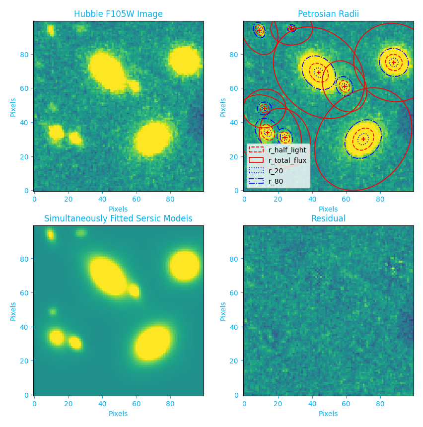

#########
PetroFit
#########

PetroFit is a package for calculating Petrosian properties, such as radii and concentration indices, as well as fitting
galaxy light profiles. This package includes tools for performing accurate photometry, segmentations, Petrosian properties
and fitting. This documentation is intended to serve as a description and guide to the `petrofit` module.

PetroFit is built on the `Photutils package <https://photutils.readthedocs.io/en/stable/>`.
    
    
.. toctree::
    :caption: Fundamentals
    :maxdepth: 3

    installation
    introduction
    photometry_and_petrosian
    fitting

.. toctree::
    :caption: Advanced
    :maxdepth: 3

    multi_object

.. toctree::
    :caption: Developer
    :maxdepth: 1

    api_reference
    correction_grids
    release_procedure
